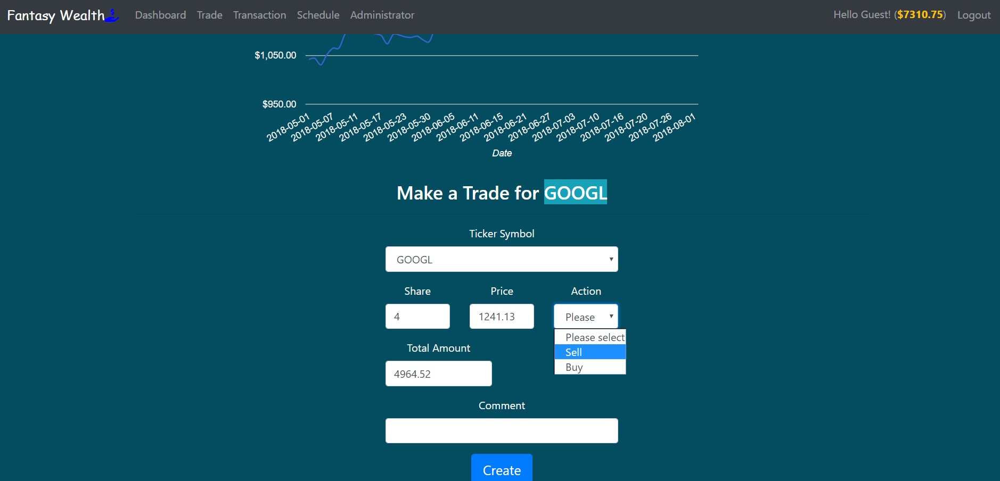
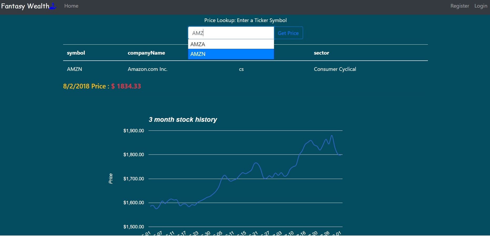

# Fantasy Wealth
A Fantasy Online Stock Trading Web application for Buying and Selling Stocks, coded from scratch with C# ASP.NET Core 2.1 framework that is a cross-platform framework for building cloud-based, Internet-connected application. 

[Visit the app live](https://fantasywealth.azurewebsites.net/)



## Step by Step and Helpful Tips for Development

### Prerequisites
- [.NET Core 2.1 SDK or later](https://www.microsoft.com/net/download/dotnet-core/2.1)
- [Visual Studio Code](https://code.visualstudio.com/download)
- [Azure CLI 2.0](https://docs.microsoft.com/en-us/cli/azure/install-azure-cli?view=azure-cli-latest)

### Creating the ASP.NET Core MVC web app by .NET Core CLI
-	Create a folder in VS Code Command Prompt named FantasyWealth
```
> mkdir FantasyWaelth
```
-	In Command Prompt change Directory to the FantasyWealth folder.
``` 
> cd FantasyWeelth
```
-	Run below dotnet command from .NET Core CLI Tools to create a new ASP.NET Core C# MVC application project in the current directory 
   ``` 
  c:\FantasyWeelth> dotnet new mvc -au None -lang C# -f  netcoreapp2.1 
   ```
##### Note: - ```>dotnet new mvc``` also works because in ```dotnet new``` the default language is C#, default framework is the latest version installed on the machine unless specified and The type of authentication is None. When running the Scaffold identity into the application it adds login functionality to the application for adding custom user data to Identity and other modification.
- To test the application project is created correctly run below command and browse  http://localhost:5000  or   https://localhost:5001
```
c:\FantasyWeelth> dotnet run
```
- Add ```.gitignore, README.md``` files to the project.
##### Note:  Before adding User Identity for login and Entity Framework for storing data let's change layout.cshtml and  update Bootstrap and jQuery of the MVC template. Using Bower but deprecated.
#### Manage client-side packages with Bower 
- Adding ```bower.json and .bowerrc``` files to add "bootstrap" , "jquery" to the dependencies.
- Run ```>bower install```
- Configure bundling and minification by adding ```bundleconfig.json``` at the root of the project. 
- ```dotnet add package BuildBundlerMinifier```
- ```dotnet build```
- adding ```font-awesome & popper.js``` by ```bower.json``` to run ```>bower install```.
- adding the font-awesome CSS popper.js files to the environment Tag Helper for Development and Production in ```_Layout.cshtml``` file.
- new looks by modifying _Layout.cshtml
##### The bower.json looks like 
```
{
    "name": "fantasywealth",
    "private": true,
    "dependencies": {
      "bootstrap": "4.1.2",
      "jquery" : "3.3.1",
      "fontawesome": "5.1.0",
      "popper.js":"1.14.3",
      "jquery-ui": "latest"
    }
}
```

# Hosting the ASP.NET Core MVC web app on Azure
Follow the below steps to push the application into Azure by  Azure CLI 2.0 & git
#### Change xxxxxxxxxxxxGroup, xxxxxxxxxxxxxPlan, xxxxxuser, xxxxxxxpassword to your own info.
- ```> az login```
- ```> az webapp create --name "FantasyWealth" --resource-group "xxxxxxxxxxxxGroup" --plan "xxxxxxxxxxxxxPlan"```
- ```> az webapp deployment user set --user-name "xxxxxuser" --password "xxxxxxxpassword"```
- ```> az webapp deployment source config-local-git -n "FantasyWealth" -g "xxxxxxxxxxxxGroup" --query [url] -o tsv```
##### The result of executing the last above command is git url that we use below in git remote add azure url command.
- ```> git add . & git commit -m "comment"```
##### Note before doing git add and commit the project must been initialized by git init
- ```> git remote add azure "url"``` url is from above.
- ```> git push azure master ``` will be asked for the password that you set above
# Entity Framework Core and Authentication
1. Installing below packages:
- ```> dotnet add package Microsoft.EntityFrameworkCore.SqlServer```
- ```> dotnet add package Microsoft.EntityFrameworkCore.Tools```
- ```>  dotnet add package Microsoft.VisualStudio.Web.CodeGeneration.Design```
- ```> dotnet restore```
2. Including Authorization and Scaffold identity into the project
###### Installing ASP.NET Core Identity scaffolder:
- Run the following command to list the Identity scaffolder options: ```> dotnet aspnet-codegenerator identity --help```
- One option is ```--useDefaultUI``` But the project doesn't need to override all files. For this project(The FantasyWeelth App.) Choosing --files ```Account.Register``` , ```Account.Manage.Index``` ,  ```Account.Manage._Layout``` 
- Run ```> dotnet aspnet-codegenerator identity --listFiles``` to List the files that can be scaffolded.
- --userClass name will be ```FantasyWealthUser```  and Not using --dbContext to be generated at the first time. 
##### Not using --useSqlite
##### Note: Because the list of semicolon separated files in this command ```> dotnet aspnet-codegenerator identity -u FantasyWealthUser --list-files Account.Register;Account.Manage.Index;Account.Manage._Layout ``` didn't work So Doing in seperated command by --force option to overwrite dbContext.

- Finally run the following commands: 
#### !Important: In all include --userClass FantasyWealthUser with --force to overwrite
```
> dotnet aspnet-codegenerator identity --userClass FantasyWealthUser --files  Account.Register
```
```
> dotnet aspnet-codegenerator identity --userClass FantasyWealthUser  --files  Account.Manage.Index --dbContext FantasyWealthIdentityDbContext --force
```
```
> dotnet aspnet-codegenerator identity --userClass FantasyWealthUser --files  Account.Manage._Layout --dbContext FantasyWealthIdentityDbContext --force
```

##  Migrations, UseAuthentication, and layout
##### Note: Update ConnectionStrings generated by ```aspnet-codegenerator``` using SQL Server accordingly.
- Migrations provide a way to create the database and to apply schema changes to the database. So everytime any changes in models/tables needs Migration and update database following commands
- ```> dotnet ef migrations add xxxxxxx``` The xxxxxxx is name parameter for the ```ef migration add``` command is arbitrary.
#### To undo this Migration, use 'dotnet ef migrations remove' that Removes the last migration.
- ```> dotnet ef database update```
- Add ```app.UseAuthentication()``` in Startup.cs file to enable Authentication.
- Add Login/Sign up to the layaout.cshtml file.
- Run the application to test and publish it into Azure. ```git push azure master```
- Add and setup SQL Database in Azure for the application.

# Creating Models and .......
- FantasyWealth Database at the beginning would be simple. 
- Creating TickerSymbol.cs, Trade.cs, Transaction.cs, Wealth.cs. and EnumCollections.cs. We will also create  ViewModels.
- Update FantasyWealthIdentityDbContext.cs to add DbSet and decimal Data Type.
- Run ```dotnet ef migrations add AddingModels``` and ```dotnet ef database update```  
- First update User Table to add First Name & Last Name.
- Update Register.cs 
- Run ```dotnet ef migrations add AddingUserData``` and ```dotnet ef database update```
1. Edited return url in Login.cshtml.cs file. changed to ~/Dashboard/Index.
2. Modified _Layout to add Search box and Authorized user Menu options.
3. Add a CashBalanceAmount as custome user date to User data model to store cash balance amount. At creating a new account the user will get $10,000.00 Cash. Modified files are: FantasyWealthUser.cs, Account/Manage/Index.cshtml.cs, Account/Manage/Index.cshtml, and Account/Register.cshtml.cs that we apply $10,000.00.
#### !Important: DataType is [DataType(DataType.Currency)] also add the decimal type precision (decimal(18,2)) in DbContext file to override OnModelCreating as below 
```
builder.Entity<FantasyWealthUser>().Property(FantasyWealthUser => FantasyWealthUser.CashBalanceAmount)
            .HasColumnType("decimal(18,2)");
```
- Don't forget to run ```dotnet ef migrations add AddingCashBalanceAmount``` and ```dotnet ef database update```
- When push to Azure, login to Azure account and run the ```dotnet ef database update``` in Azure Console.

### Changes:
- Removed IdentityHostingStartup from Identity folder. Registered DbContext in the main Startup.cs
- Added Roles to the application.
- Model changed to add relation between TickerSymbol and Trade, Wealth
- Added a basic auto complete function into Symbol search box by using jQuery UI:
```
$(document).ready(function () {
    $('#SearchSymbol').autocomplete({
        source: function (request, response) {
            $.ajax({
                url: "/OpenAPI/getSymbolAutocomplete/?txtSymbol=" + $("#SearchSymbol").val(),
                type: "GET",
                contentType: "application/json; charset=utf-8",
                success: function (data) {
                    response(data);
                }
            })
        }
    });
});
```

```
[HttpGet]
        public async Task<List<string>> getSymbolAutocomplete(string txtSymbol)
        {
            var symbols = from m in _context.TickerSymbols
                          orderby m.Symbol
                          where m.Symbol.Contains(txtSymbol)
                          select m.Symbol;
            return (await symbols.ToListAsync());
        }
```

### Removing [Required] attribute , assigning Default value to a property in a model from OnModelCreating method.

## [Visit the app live](https://fantasywealth.azurewebsites.net/)


```
>dotnet aspnet-codegenerator identity --help 

Usage: aspnet-codegenerator [arguments] [options]
 Arguments:
  generator  Name of the generator. Check available generators below.

Options:
  -p|--project             Path to .csproj file in the project.
  -n|--nuget-package-dir
  -c|--configuration       Configuration for the project (Possible values: Debug/ Release)
  -tfm|--target-framework  Target Framework to use. (Short folder name of the tfm. eg. net46)
  -b|--build-base-path
  --no-build

Selected Code Generator: identity

Generator Options:
  --dbContext|-dc      : Name of the DbContext to use, or generate (if it does not exist).
  --files|-fi          : List of semicolon separated files to scaffold. Use the --list-files option to see the available options.
  --listFiles|-lf      : Lists the files that can be scaffolded by using the '--files' option.
  --userClass|-u       : Name of the User class to generate.
  --useSqLite|-sqlite  : Flag to specify if DbContext should use SQLite instead of SQL Server.
  --force|-f           : Use this option to overwrite existing files.
  --useDefaultUI|-udui : Use this option to setup identity and to use Default UI.
  --layout|-l          : Specify a custom layout file to use.
  --generateLayout|-gl : Use this option to generate a new _Layout.cshtml 
  ```

```
>dotnet aspnet-codegenerator identity --listFiles
##### File List:
Account.AccessDenied
Account.ConfirmEmail
Account.ExternalLogin
Account.ForgotPassword
Account.ForgotPasswordConfirmation
Account.Lockout
Account.Login
Account.LoginWith2fa
Account.LoginWithRecoveryCode
Account.Logout
Account.Manage._Layout
Account.Manage._ManageNav
Account.Manage._StatusMessage
Account.Manage.ChangePassword
Account.Manage.DeletePersonalData
Account.Manage.Disable2fa
Account.Manage.DownloadPersonalData
Account.Manage.EnableAuthenticator
Account.Manage.ExternalLogins
Account.Manage.GenerateRecoveryCodes
Account.Manage.Index
Account.Manage.PersonalData
Account.Manage.ResetAuthenticator
Account.Manage.SetPassword
Account.Manage.TwoFactorAuthentication
Account.Register
Account.ResetPassword
Account.ResetPasswordConfirmation
```